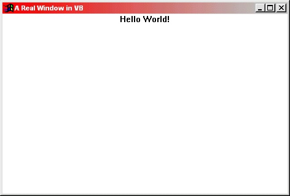



## Create a Window from scratch using CreateWindowEx

### Description

This example will create a window from scratch. When working with a window that you created, you can do anything you want as you would in Win32 C++. This includes full screen OpenGL/DirectX apps, as well as other fancy tricks you couldn't do in VB
 
### More Info
 

             |
---                |---
**Submitted On**   |2002-05-15 14:21:38
**By**             |[Andrew Heinlein \(Mouse\)](https://github.com/Planet-Source-Code/PSCIndex/blob/master/ByAuthor/andrew-heinlein-mouse.md)
**Level**          |Intermediate
**User Rating**    |5.0 (10 globes from 2 users)
**Compatibility**  |VB 5\.0, VB 6\.0
**Category**       |[Windows API Call/ Explanation](https://github.com/Planet-Source-Code/PSCIndex/blob/master/ByCategory/windows-api-call-explanation__1-39.md)
**World**          |[Visual Basic](https://github.com/Planet-Source-Code/PSCIndex/blob/master/ByWorld/visual-basic.md)
**Archive File**   |[Create\_a\_W835405152002\.zip](https://github.com/Planet-Source-Code/andrew-heinlein-mouse-create-a-window-from-scratch-using-createwindowex__1-34819/archive/master.zip)

